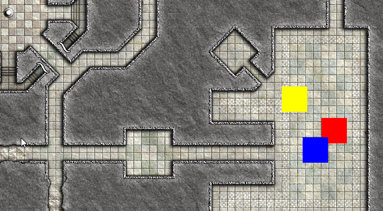

# Scene graph starter code for .NET SFML

## This is a simple scene graph implementation using .NET SFML.

It is based on Nuget.SFML V2.6.1 and .NET 8.0.  

## Usage

The three rectangles are building the scene graph.  
The root node is the yellow rectangle.  
When clicked on the root node, it will move with the mouse. The two children follow the root node.  
When clicked on the one of child nodes, they will move individually with the mouse.  
A right click will stop the movement for both kind of nodes.  

The background can be moved with the cursor keys.  
The mouse wheel will zoom in and out.
The rectangles are independent of the background.

## Implementation

Node is an abstract class that does the magic.  
Node inherits from SFML.Graphics.Transformable and it implements SFML.Graphics.IDrawable.  
AddChild() creates the relationship between the nodes.  

RectangleNode is a concrete implementation of Node. It contains a SFML.Graphics.RectangleShape as a member.  

[Some background infoe](https://www.sfml-dev.org/tutorials/3.0/graphics/transform/#transforming-your-own-classes)

